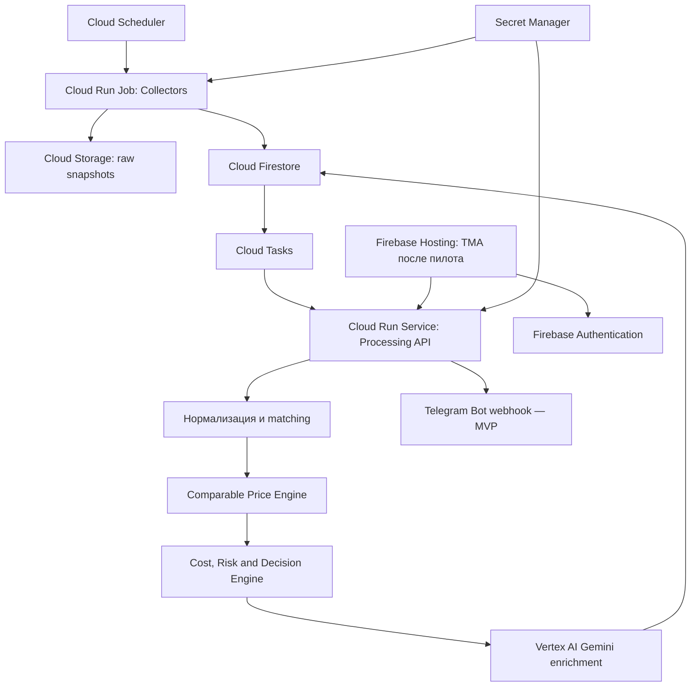

# Спецификация проекта: Dubai Deal Sniper

## 1. Назначение и границы

**Dubai Deal Sniper** — сервис мониторинга объявлений о продаже подержанных автомобилей с фиксированной ценой в ОАЭ. Система находит новые и подешевевшие автомобили, сопоставляет их с рыночными аналогами, рассчитывает допустимую цену покупки и отправляет пользователю объяснимое уведомление.

Первый пользовательский интерфейс продукта — простой Telegram-бот. После проверки качества сигналов backend расширяется Telegram Mini App (TMA), которая использует тот же API и ту же базу данных. TMA не входит в первый технический MVP.

В продукт не входят:

- недвижимость;
- автомобильные аукционы и автоматические ставки;
- покупка автомобиля без решения пользователя;
- использование ответа LLM как единственного источника рыночной цены.

### Целевая аудитория

- перекупщики и небольшие автомобильные трейдеры;
- покупатели, ищущие недооценённый автомобиль для личного использования.

### Главный вопрос продукта

> До какой цены автомобиль безопасно покупать, чтобы после всех расходов сохранить требуемую прибыль при допустимом риске?

Главный результат — не бинарный `is_deal`, а структурированное решение:

- максимальная допустимая цена покупки;
- консервативный диапазон цены перепродажи;
- полная себестоимость;
- ожидаемая чистая прибыль и ROI;
- уровень уверенности и причины риска;
- действие: `contact`, `watch`, `inspect` или `reject`.

---

## 2. Источники данных

Источники разделяются по смыслу цены. Asking price частника, дилерская цена с гарантией, C2B-предложение и фактическая цена собственной сделки не должны усредняться без поправок.

### Первая волна

1. **Dubizzle** — новые объявления, изменения asking price, частные и дилерские предложения.
2. **DubiCars** — дополнительные рыночные аналоги и лиды.
3. **YallaMotor** — used, new и certified предложения для расширения покрытия.
4. **BuyAnyCar Historical Values** — ориентиры исторических C2B-транзакций после проверки доступности и покрытия.
5. **RTA Vehicle Status / Inspection** — ручная проверка истории и состояния для отобранных автомобилей.
6. **Собственные результаты** — цена покупки, ремонт, продажа и срок экспозиции как ground truth.

### Вторая волна

- CarSwitch;
- Cars24 UAE;
- OpenSooq;
- Al-Futtaim Automall;
- Al Tayer Pre-Owned;
- SellAnyCar как ориентир быстрой ликвидации;
- PartSouq как ориентир стоимости деталей;
- CarReport для дополнительной VIN-проверки после валидации покрытия.

Перед подключением каждого внешнего источника проверяются формат данных, авторизация, лимиты, частота обновления, стабильность схемы и стоимость интеграции.

---

## 3. Архитектура

Целевой backend строится на Firebase и Google Cloud без отдельного VPS и постоянно работающего локального процесса.



### 3.1. Source Registry

Для каждого источника хранит:

- роль и тип цены;
- способ и частоту доступа;
- доступные поля;
- уровень доверия;
- правила дедупликации;
- время последней успешной проверки;
- состояние схемы и адаптера.

### 3.2. Marketplace Collectors

Получают объявления с фиксированной ценой. Рекомендуемая базовая частота — раз в 5–15 минут с техническим ограничением частоты запросов. Коллектор сохраняет исходные данные до нормализации и не вызывает Gemini.

Запрещено незаметно заменять недоступный источник тестовыми объявлениями. Mock-режим должен включаться только явной конфигурацией разработки.

### 3.3. Снимки и версии

Одно объявление может изменяться. Для него сохраняются версии:

- asking price;
- описание и характеристики;
- фотографии;
- статус доступности;
- время наблюдения.

Повторная оценка запускается только для нового объявления или материального изменения. Простая повторная загрузка той же версии не должна вызывать Gemini.

Каждая processing task адресует точную версию `listing_id + content_hash`. Обработчик загружает именно этот snapshot и отказывается от расчёта при его отсутствии. Указатель current обновляется транзакционно и только монотонно по `observed_at`, поэтому запоздавший collector не может вернуть объявление к старой версии.

Жизненный цикл объявления содержит `active`, `changed`, `stale`, `removed` и `quarantined`, а также `first_seen_at` и `last_seen_at`. Исчезновение с первых страниц поиска само по себе не доказывает удаление; состояние `removed` требует подтверждения detail page либо устойчивого правила источника.

### 3.4. Межсайтовое объединение

Один автомобиль может одновременно размещаться на нескольких сайтах. До расчёта рынка записи объединяются по:

1. VIN;
2. телефону продавца;
3. устойчивому хешу фотографий;
4. сочетанию марки, модели, года, комплектации, пробега, цвета и описания.

Дубли не считаются независимыми рыночными аналогами.

### 3.5. Нормализация

Минимальные нормализованные признаки:

- марка, модель и поколение;
- год и комплектация;
- двигатель, привод и коробка передач;
- GCC/import specification;
- пробег;
- тип продавца;
- эмират;
- история ДТП и признаки повреждений;
- сервисная история и гарантия, если доступны.

### 3.6. Comparable Price Engine

Детерминированно строит диапазон цены по сопоставимым автомобилям. Отдельно учитывает:

- private asking;
- dealer asking;
- certified retail;
- C2B/быструю ликвидацию;
- собственные фактические продажи.

Результат содержит нижнюю, медианную и верхнюю оценку, количество уникальных аналогов, свежесть данных и уровень покрытия.

В Comparable Engine допускаются только объявления с подтверждённой detail-page ценой. Типы `private`, `dealer`, `certified` и `C2B` рассчитываются раздельно. Отбор аналогов не ограничивается отношением к asking price оцениваемого автомобиля; причины принятия и отклонения каждого аналога сохраняются. Решение содержит `market_fingerprint`, поэтому изменение набора или цены аналогов создаёт новую версию оценки.

### 3.7. Cost and Risk Engine

Полная себестоимость:

```text
цена покупки
+ проверка и регистрация
+ ожидаемый ремонт
+ подготовка к продаже
+ хранение и стоимость капитала
+ расходы на продажу
+ резерв риска
```

Стоп-факторы переводят автомобиль в `inspect` или `reject`: неизвестные документы, повреждение шасси, признаки затопления, критически неполные характеристики, неподтверждённый VIN и недостаток сопоставимых автомобилей.

### 3.8. Decision Engine

```text
expected_profit = conservative_resale_price - total_cost
roi = expected_profit / invested_capital
max_purchase_price = conservative_resale_price
                     - non_purchase_costs
                     - target_profit
                     - risk_reserve
```

Финансовая арифметика выполняется приложением, а не LLM.

### 3.9. LLM Enrichment

LLM применяется только после сохранения новой версии объявления и дешёвой предварительной фильтрации. Допустимые задачи:

- извлечение повреждений и комплектации из текста;
- классификация неструктурированных рисков;
- краткое объяснение уже рассчитанного решения.

LLM не является источником окончательной рыночной цены и не пересчитывается при неизменившейся версии объявления.

### 3.10. Пользовательские интерфейсы

Backend работает постоянно и не зависит от того, открыт ли Telegram. Коллекторы, расчёты и повторная доставка выполняются фоновыми задачами. Telegram-бот и будущая TMA являются клиентами прикладного API, а не местом выполнения сбора и финансовых расчётов.

#### 3.10.1. Telegram-бот — первый MVP

Telegram-уведомление отправляется при:

- появлении нового подходящего автомобиля;
- снижении цены, изменившем решение;
- переходе в `contact` или `inspect`;
- существенном изменении риска.

Алерт содержит asking price, максимальную цену покупки, рыночный диапазон, расходы, прибыль, ROI, confidence, риски и ссылку для связи с продавцом.

Минимальные команды и действия бота:

- `/start` — регистрация пользователя и краткое объяснение продукта;
- `/settings` — просмотр активных параметров поиска;
- `/status` — состояние мониторинга и время последней успешной проверки;
- кнопка «Открыть объявление»;
- кнопка «В избранное»;
- кнопки «Связаться», «Осмотреть», «Отклонить» для записи реакции пользователя.

Настройки первого MVP допускается хранить в `.env` для одного пользователя. До подключения нескольких пользователей конфигурация переносится в базу данных и связывается с `telegram_user_id`.

#### 3.10.2. Telegram Mini App — развитие после пилота

TMA добавляется только после подтверждения качества рыночной оценки и полезности Telegram-сигналов. Она использует существующий Application API и предоставляет:

- ленту новых и подешевевших автомобилей;
- фильтры поиска и управление бизнес-порогами;
- полную карточку решения с аналогами и историей цены;
- избранное и статусы работы с автомобилем;
- ввод результатов осмотра, покупки, ремонта и продажи;
- агрегированную статистику фактической прибыли и ROI.

Авторизация TMA выполняется через проверку подписанных Telegram `initData` на backend. Нельзя доверять переданному клиентом `telegram_user_id` без криптографической проверки. Добавление TMA не должно менять коллекторы, ценовой движок и Decision Engine.

После успешной проверки `initData` backend создаёт Firebase custom token с UID, производным от Telegram user ID. TMA входит через Firebase Authentication и получает доступ только к разрешённым данным пользователя.

#### 3.10.3. Бесплатный и Pro-каналы

Публичный канал и закрытый Pro-канал являются разными продуктами и получают разные представления одного проверенного решения.

Публичный канал получает короткий англоязычный тизер:

- марка, модель, год и одна фотография;
- тип сигнала без точной финансовой модели;
- ориентировочная величина скидки только при достаточной уверенности;
- призыв открыть Telegram-бота или присоединиться к Pro;
- без ID объявления, прямой ссылки продавца, полного диапазона рынка, прибыли, ROI, максимальной цены покупки и списка аналогов.

Pro-канал получает полную проверенную карточку: цену и ссылку продавца, рынок, максимальную цену покупки, детализацию расходов, прибыль, ROI, confidence, risk flags, причины решения, размер выборки, использованные и отклонённые аналоги, версию Engine и дату рыночного среза. Одна версия объявления имеет независимые notification ID для публичного, Pro и персонального получателя.

Новые публикации обязаны использовать разделение контента. Старые полные сообщения в публичном канале очищаются отдельной операцией: Telegram Bot API не позволяет получить полную историю канала, поэтому без заранее сохранённых `message_id` требуется ручное удаление владельцем.

#### 3.10.4. Подбор автомобиля по запросу пользователя

Личный Telegram-бот открыт пользователям для поиска, но административные команды доступны только роли `admin`. Пользователь может написать `/find` и запрос на русском или английском, например: `Toyota Prado, 2020+, GCC, до 180000 AED, пробег до 100000 км`.

Backend преобразует запрос в проверяемую структуру `SearchRequest`:

- марка и модель;
- минимальный и максимальный год;
- максимальная цена и пробег;
- specification, кузов и другие поддерживаемые признаки;
- минимальная прибыль и ROI для инвестиционного режима;
- язык, статус и срок действия запроса.

Извлечение параметров может использовать Vertex AI только как parser текста. Перед поиском результат показывается пользователю для подтверждения; неизвестные значения не додумываются. Поиск выполняется по текущим нормализованным объявлениям, а цена каждого результата повторно проверяется на detail page. При отсутствии результата запрос становится подпиской на новые совпадения.

#### 3.10.5. Панель управления

Отдельная административная панель размещается на Firebase Hosting и обращается к Admin API в Cloud Run. Вход выполняется через Firebase Authentication; backend проверяет Firebase ID token и роль `admin`. Telegram allowlist не заменяет авторизацию панели.

Первая версия панели предоставляет:

- обзор состояния источников, очередей, планировщиков и последних ошибок;
- включение, отключение и ручной запуск зарегистрированных источников;
- просмотр кандидатов, карантина, проверок цены и истории публикаций;
- управление версионированными порогами прибыли, ROI и качества данных;
- настройку публичного, Pro и информационного расписаний;
- просмотр пользователей, поисковых запросов и подписок без отображения секретов;
- предварительный просмотр публикации и ручное подтверждение спорного материала;
- неизменяемый журнал административных действий.

Токены и ключи не показываются и не редактируются в панели: они остаются в Secret Manager. Изменение финансовых порогов создаёт новую версию конфигурации и не переписывает старые решения.

#### 3.10.6. Информационный контент для аудитории

Контентный модуль поддерживает интерес аудитории только фактами из проверенной базы:

- ежедневный market pulse по числу новых машин и изменениям цены;
- крупнейшие подтверждённые price drops;
- недельные обзоры моделей, диапазонов цены и ликвидности;
- объяснение отдельного предложения и используемых аналогов;
- опросы и призывы сформировать персональный запрос в боте.

Каждая публикация содержит период данных и размер выборки. LLM может улучшить формулировку, но не создаёт числа и факты. Материал с недостаточной выборкой не публикуется. Частота, рубрики и режим `draft/automatic` управляются из панели.

#### 3.10.7. WhatsApp

Система формирует независимое событие `PublicationEvent`, которое может доставляться несколькими адаптерами. В [официальной коллекции Meta](https://www.postman.com/meta/whatsapp-business-platform/folder/o48mro7/messages) WhatsApp Business Cloud API описана отправка сообщений клиентам, а `recipient_type` в операциях отправки ограничен отдельным получателем; отдельного Channels endpoint в опубликованной коллекции нет. Поэтому автоматическая публикация в WhatsApp Channel не заявляется как доступная функция, а неофициальная автоматизация WhatsApp Web в план не включается.

Поддерживаемый официальный вариант — рассылка подписавшимся получателям через WhatsApp Business Cloud API после настройки WABA, business phone number, шаблонов и секретов. Адаптер включается только после предоставления владельцем рабочих Meta-реквизитов и успешной тестовой доставки. Если Meta выпустит официальный Channels API, к `PublicationEvent` добавляется отдельный channel-adapter без изменения расчётного ядра.

### 3.11. Google Cloud backend

Целевая инфраструктура:

- **Cloud Run Service** — Python 3.11 + FastAPI, Telegram webhook, Application API, обработчики Cloud Tasks и будущий API TMA;
- **Cloud Run Jobs** — конечные запуски коллекторов классифайдов;
- **Cloud Scheduler** — запуск каждого коллектора по расписанию;
- **Cloud Firestore Native mode** — оперативные сущности, версии объявлений, решения, настройки и действия пользователей;
- **Cloud Tasks** — надёжная обработка новых версий, ограничение частоты и повтор Telegram-уведомлений;
- **Cloud Storage** — исходные HTML/JSON-снимки и крупные технические объекты, которые не следует помещать в Firestore;
- **Vertex AI Gemini через `google-genai`** — LLM enrichment с авторизацией service account;
- **Secret Manager** — Telegram token и другие секреты;
- **Cloud Logging и Cloud Monitoring** — логи, ошибки, задержки и алерты;
- **Firebase Hosting** — frontend административной панели, будущей TMA и проксирование `/api/**` в Cloud Run;
- **Firebase Authentication** — административная сессия панели и пользовательская сессия TMA после серверной проверки Telegram `initData`;
- **BigQuery** — необязательный аналитический слой после накопления истории; не входит в первый MVP.

В первом MVP не используются VPS, PostgreSQL, Redis и Celery. Масштабирование выполняют управляемые сервисы Google Cloud. Все ресурсы размещаются в одном согласованном регионе, если источник или сервис не требует иного.

Коллектор не выполняется внутри HTTP-запроса пользователя. Cloud Run Job получает данные источника, сохраняет сырой снимок и Firestore-метаданные, после чего создаёт идемпотентную Cloud Task для обработки новой версии.

---

## 4. Состояния обработки

```text
discovered
→ persisted
→ matched
→ normalized
→ priced
→ risk_checked
→ contact / watch / inspect / reject
→ alerted
→ outcome_recorded
```

Сохранение `persisted` выполняется до Gemini. Состояние отправки Telegram хранится независимо, чтобы повтор уведомления не требовал повторной оценки.

Доставка через внешний API имеет outbox-состояния `pending`, `sending`, `sent`, `failed` и `unknown`. Строгая гарантия exactly-once не заявляется, поскольку Telegram не принимает клиентский idempotency key. При неоднозначном результате внешнего вызова запись переводится в `unknown` для сверки и не отправляется повторно вслепую.

---

## 5. Минимальные модели данных Firestore

Рекомендуемые пути документов:

```text
sources/{source_id}
listings/{listing_id}
listings/{listing_id}/snapshots/{content_hash}
vehicles/{vehicle_id}
decisions/{decision_id}
users/{telegram_user_id}/settings/current
users/{telegram_user_id}/favorites/{vehicle_id}
notifications/{notification_id}
outcomes/{outcome_id}
search_requests/{request_id}
publication_events/{event_id}
content_posts/{post_id}
admin_audit/{event_id}
```

`listing_id`, `content_hash`, `decision_id` и `notification_id` должны быть детерминированными там, где это необходимо для идемпотентности Cloud Tasks и повторных запусков Jobs. Согласованные изменения состояния выполняются Firestore transaction или batched write.

### ListingSnapshot

- `source`;
- `external_id`;
- `url`;
- `observed_at`;
- `asking_price_aed`;
- `title` и `raw_description`;
- исходные характеристики и фотографии;
- `content_hash`;
- `availability_status`.

### VehicleIdentity

- нормализованные марка, модель, поколение, год и trim;
- VIN при наличии;
- пробег и specification;
- связи со снимками разных источников;
- confidence межсайтового совпадения.

### DealDecision

- `market_price_low_aed`;
- `market_price_median_aed`;
- `market_price_high_aed`;
- `max_purchase_price_aed`;
- `total_cost_aed`;
- `expected_profit_aed`;
- `roi_percent`;
- `confidence`;
- `action`;
- `risk_flags`;
- список использованных аналогов и происхождение данных.

---

## 6. Конфигурация и секреты

Локально параметры читаются из `.env`. В Google Cloud несекретная конфигурация передаётся как environment variables Cloud Run, а секреты подключаются из Secret Manager. Service account JSON запрещено включать в образ или репозиторий: Cloud Run использует Application Default Credentials и отдельные service accounts с минимальными IAM-ролями.

Минимальный набор несекретных параметров:

- `TARGET_PROFIT_AED`;
- `MIN_ROI_PERCENT`;
- `MAX_HOLD_DAYS`;
- `RISK_RESERVE_PERCENT`;
- `MIN_COMPARABLES_COUNT`;
- `AED_TO_USD_RATE`;
- `GOOGLE_CLOUD_PROJECT`;
- `GOOGLE_CLOUD_REGION`;
- `FIRESTORE_DATABASE`;
- имена Cloud Tasks queues и Cloud Storage bucket;
- Vertex AI location и имя модели;
- явный флаг `ENABLE_MOCK_SOURCES=false`.

Частота сбора задаётся расписанием Cloud Scheduler в Infrastructure as Code, а не бесконечным циклом и не переменной процесса Cloud Run.

В Secret Manager хранятся Telegram bot token и учетные данные внешних источников, если они потребуются. Для Telegram-бота задаётся разрешённый `TELEGRAM_USER_ID` или список пользователей. `TMA_URL` добавляется только на этапе Mini App.

Для панели в конфигурации хранится список разрешённых Firebase UID или custom claim `admin`. Для официальной WhatsApp Business-доставки в Secret Manager хранятся access token и webhook secret; phone number ID и версия Graph API являются несекретной конфигурацией. До настройки этих параметров WhatsApp-адаптер выключен.

Индексы Firestore, Firebase Security Rules, конфигурация Hosting и описание ресурсов Google Cloud хранятся в репозитории. Рекомендуемый способ воспроизводимого развёртывания — Terraform либо эквивалентный Infrastructure as Code.

Пороговые значения утверждаются после фиксации капитала, целевого сегмента и результатов пилота.

---

## 7. Метрики качества

1. Доля проверенных сигналов, сохранивших требуемую прибыль после осмотра.
2. Ошибка прогноза цены продажи.
3. Ошибка оценки ремонта.
4. Фактическая чистая прибыль и ROI завершённых сделок.
5. Время от публикации до полезного уведомления.
6. Доля межсайтовых дублей.
7. Число обращений к LLM на одну версию объявления.
8. Потерянные и повторные Telegram-уведомления.
9. Конверсия публичного тизера в запуск бота и подписку Pro.
10. Число активных поисковых запросов и доля запросов с найденным результатом.
11. Доля информационных публикаций, прошедших проверку достаточности данных.
12. Успешность доставки по каждому каналу независимо.

---

## 8. Порядок реализации

1. Остановить использование legacy LLM-конвейера как источника финансового решения.
2. Зафиксировать контракт решения и подготовить контрольный набор объявлений и аналогов.
3. Реализовать чистые Domain Models, Comparable Price Engine, Cost/Risk Engine и Decision Engine.
4. Покрыть расчётное ядро unit-тестами и добавить GitHub Actions.
5. Ограничить Vertex AI извлечением признаков и объяснением готового решения.
6. Подготовить Google Cloud foundation, IAM, Secret Manager и Infrastructure as Code.
7. Реализовать Firestore-модель, Cloud Storage, индексы и идемпотентность.
8. Реализовать Cloud Tasks processing pipeline и первый collector Cloud Run Job.
9. Выпустить Cloud Run Application API и Telegram-бот с повтором доставки.
10. Провести пилот, откалибровать коэффициенты и контролировать облачные расходы.
11. Подключить дополнительные классифайды и межсайтовое объединение.
12. Разделить публичные тизеры и полные Pro-карточки.
13. Добавить подбор по пользовательскому запросу и подписки на новые совпадения.
14. Выпустить административную панель на Firebase Hosting/Auth.
15. Добавить проверяемые информационные публикации и общий `PublicationEvent`.
16. Подключить официальный WhatsApp Business adapter после настройки Meta; WhatsApp Channel не автоматизировать без официального API.
17. Добавить TMA на Firebase Hosting/Auth и outcome-аналитику.

Подробные этапы и границы релизов описаны в `docs/IMPLEMENTATION_PLAN.md`, а схема ресурсов, потоков, IAM и идемпотентности — в `docs/CLOUD_ARCHITECTURE.md`.
