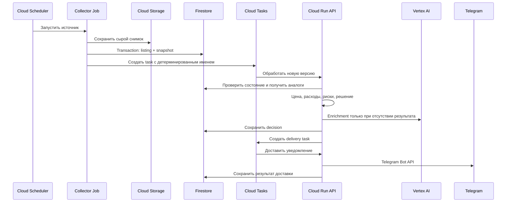

# Google Cloud архитектура Dubai Deal Sniper

## Граница системы

Backend размещается в существующей экосистеме Firebase/Google Cloud. Первый клиент — Telegram-бот; после пилота добавляется TMA. Оба интерфейса используют одну бизнес-логику и Firestore.

## Ресурсы

| Ресурс | Назначение |
|---|---|
| Cloud Run Service `deal-sniper-api` | FastAPI, Telegram webhook, Cloud Tasks handlers, API TMA |
| Cloud Run Job `collector-{source}` | Конечный запуск коллектора одного источника |
| Cloud Scheduler | Расписание отдельных collector Jobs |
| Cloud Firestore | Операционные документы, версии, решения и пользователи |
| Cloud Storage | Сырые HTML/JSON-снимки и крупные объекты |
| Cloud Tasks `listing-processing` | Идемпотентная обработка новых версий |
| Cloud Tasks `telegram-delivery` | Ограничение частоты и повтор уведомлений |
| Vertex AI | Gemini enrichment через `google-genai` |
| Secret Manager | Telegram token и секреты внешних источников |
| Firebase Hosting | Статические файлы будущей TMA и `/api/**` rewrite |
| Firebase Authentication | Сессия TMA после проверки Telegram `initData` |
| Cloud Logging/Monitoring | Логи, метрики и эксплуатационные алерты |
| BigQuery | Опциональная аналитика после накопления истории |

## Поток нового объявления



## Firestore

Основные пути:

```text
sources/{source_id}
listings/{listing_id}
listings/{listing_id}/snapshots/{content_hash}
vehicles/{vehicle_id}
decisions/{decision_id}
users/{telegram_user_id}/settings/current
users/{telegram_user_id}/favorites/{vehicle_id}
notifications/{notification_id}
outcomes/{outcome_id}
```

Сырые ответы не дублируются в документах Firestore: хранится `gs://` URI, checksum, тип содержимого и время получения. Поля для поиска аналогов денормализуются и индексируются: `make`, `model`, `generation`, `year`, `trim`, `specification`, `mileage_bucket`, `seller_type`, `asking_price_aed`, `observed_at`, `comparison_key`.

## Идемпотентность

- `listing_id = hash(source_id + external_id)`;
- snapshot document ID равен `content_hash`;
- Cloud Task name включает listing ID, content hash и тип обработки;
- enrichment key включает snapshot, prompt version, schema version и model;
- notification ID включает user, decision version и notification type;
- обработчик сначала проверяет сохранённый статус, затем выполняет внешний вызов;
- повтор Tasks не должен создавать повторный Vertex AI вызов или Telegram-сообщение.

## Авторизация и секреты

Cloud Scheduler, Tasks и Jobs вызывают Cloud Run через service accounts и OIDC/IAM. Каждый runtime service account получает только необходимые роли. Telegram token доступен только API-сервису через Secret Manager.

TMA не доверяет клиентскому Telegram user ID. Cloud Run проверяет `initData`, создаёт Firebase custom token и связывает Firebase UID с Telegram ID. Security Rules ограничивают пользовательские коллекции владельцем; административные записи создаются только Firebase Admin SDK на backend.

## Развёртывание

Рекомендуемый контур:

1. Terraform создаёт API, IAM, Firestore, Storage, Tasks, Scheduler, Secrets и Cloud Run ресурсы.
2. Cloud Build либо GitHub Actions собирает образ в Artifact Registry.
3. Один образ может использовать разные entrypoints для API и collector Jobs.
4. Firebase CLI развёртывает Hosting и Security Rules.
5. Секреты создаются отдельно и никогда не попадают в state output, логи или репозиторий.

Для локальной разработки используются Firebase Emulator Suite там, где она покрывает нужный сервис, и Application Default Credentials для интеграционных проверок в отдельном dev-проекте.

## Наблюдаемость и бюджет

Минимальные метрики:

- успешность и длительность каждого collector Job;
- количество полученных, новых и изменённых объявлений;
- глубина и возраст Cloud Tasks queues;
- доля повторов и окончательных ошибок;
- число Vertex AI вызовов на новую версию;
- время до Telegram-уведомления;
- Firestore reads/writes и Storage volume;
- стоимость обработки одного объявления.

До production включаются бюджеты Google Cloud, quota alerts и отдельные алерты на остановку коллектора, рост ошибок, очередь старше допустимого времени и аномальное число Vertex AI вызовов.
