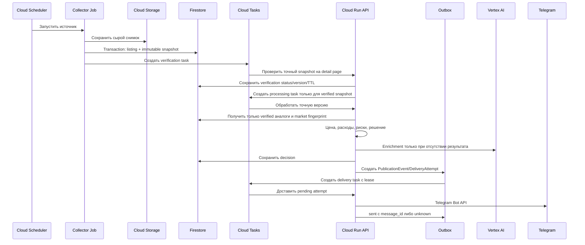

# Google Cloud архитектура Dubai Deal Sniper

## Граница системы

Backend размещается в существующей экосистеме Firebase/Google Cloud. Рабочий пользовательский клиент — Telegram-бот; следующей добавляется отдельная административная панель, после пилота — TMA. Все интерфейсы используют одну бизнес-логику и Firestore.

## Ресурсы

| Ресурс | Назначение |
|---|---|
| Cloud Run Service `deal-sniper-api` | FastAPI, Telegram webhook, Cloud Tasks handlers, Application и Admin API |
| Cloud Run Job `collector-{source}` | Конечный запуск коллектора одного источника |
| Cloud Scheduler | Расписание отдельных collector Jobs |
| Cloud Firestore | Операционные документы, версии, решения и пользователи |
| Cloud Storage | Сырые HTML/JSON-снимки и крупные объекты |
| Cloud Tasks `listing-processing` | Идемпотентная обработка новых версий |
| Cloud Tasks `telegram-delivery` | Ограничение частоты и повтор уведомлений |
| Vertex AI | Gemini enrichment через `google-genai` |
| Secret Manager | Telegram token и секреты внешних источников |
| Firebase Hosting | Административная панель, будущая TMA и `/api/**` rewrite |
| Firebase Authentication | Google sign-in администратора и сессия TMA после проверки Telegram `initData` |
| Cloud Logging/Monitoring | Логи, метрики и эксплуатационные алерты |
| BigQuery | Опциональная аналитика после накопления истории |

## Поток нового объявления



## Firestore

Основные пути:

```text
sources/{source_id}
listings/{listing_id}
listings/{listing_id}/snapshots/{content_hash}
listings/{listing_id}/verifications/{verification_key}
vehicles/{vehicle_id}
decisions/{decision_id}
current_decisions/{decision_subject_id}
users/{telegram_user_id}/settings/current
users/{telegram_user_id}/favorites/{vehicle_id}
notifications/{notification_id}
outcomes/{outcome_id}
search_requests/{request_id}
publication_events/{event_id}
delivery_attempts/{delivery_id}
content_posts/{post_id}
admin_audit/{event_id}
migrations/{migration_id}
```

Сырые ответы не дублируются в документах Firestore: хранится `gs://` URI, checksum, тип содержимого и время получения. Поля для поиска аналогов денормализуются и индексируются: `make`, `model`, `generation`, `year`, `trim`, `specification`, `mileage_bucket`, `seller_type`, `asking_price_aed`, `observed_at`, `comparison_key`.

Каждый тип production-документа содержит `schema_version`. `decision_subject_id = listing_id`; финансовое решение listing-specific, а `vehicle_id` используется для cross-source связи и отдельной дедупликации. Decision считается текущим только при совпадении current content hash, Engine, financial config, verification version и market fingerprint. Новое решение, `current_decisions/{decision_subject_id}` и `superseded_by` предыдущего решения обновляются одной Firestore transaction с precondition; concurrency test должен оставлять ровно один current. `stale`, `removed`, `quarantined`, `freshness_status != active` и `valid_until <= now` исключаются из выдачи и публикации. Выдача читает current pointer индексируемым запросом, а не полным scan.

`market_fingerprint` включает immutable evidence revision, verified price/currency, source role, extractor/config/adjustment versions и accepted/rejected status. `evidence_created_at` неизменяем. Operational freshness (`last_checked_at`, `valid_until`, `freshness_status`, attempt, latency) хранится отдельно и не меняет fingerprint. Повторная проверка той же evidence обновляет `last_checked_at`, `valid_until` и `freshness_status` без нового decision/delivery; semantic evidence change ставит затронутые `decision_subject_id` на пересчёт. Delivery дополнительно проверяет fingerprint и `valid_until > now` перед внешним вызовом.

## Идемпотентность

- `listing_id = hash(source_id + external_id)`;
- snapshot document ID равен `content_hash`;
- Cloud Task name включает listing ID, content hash и тип обработки;
- enrichment key включает snapshot, prompt version, schema version и model;
- все составные ID используют UTF-8 canonical JSON с schema tag, NFC, нормализованными Decimal/UTC timestamps, детерминированным порядком и lowercase SHA-256;
- `decision_id` хеширует объект `decision-id/v1` с listing ID, content hash, Engine, financial config, verification version и market fingerprint;
- `delivery_id` хеширует объект `delivery-id/v1` с decision ID, `delivery_recipient_id`, template version и format; recipient — Telegram user/chat/channel либо адресат другого адаптера;
- publication event ID включает тип материала, период данных, версию шаблона и целевой формат;
- обработчик сначала проверяет сохранённый статус, затем выполняет внешний вызов;
- повтор Tasks не создаёт повторный Vertex AI вызов;
- повтор delivery task не отправляет сообщение после подтверждённого `sent`, а неоднозначный результат переводит в `unknown`.

Внешний `sendMessage` и запись Firestore не образуют одну транзакцию, поэтому архитектура не обещает строгую exactly-once доставку. Outbox использует `attempt_id`, lease, timestamps, error и состояния `pending/sending/sent/failed/unknown`; неоднозначный timeout не повторяется автоматически до сверки. Запись `unknown` старше SLA создаёт alert и требует операторского `mark_sent`, `mark_failed` либо одноразового `retry_once` с audit event.

Containment использует существующий инфраструктурный kill switch: останавливает publisher/schedulers, pause processing/delivery queues и отзывает доступ delivery runtime к Telegram secret либо право бота публиковать. Application `delivery_enabled` появляется только в `0.11A` и проводится через IaC в `0.11C`. Migration tooling полностью реализуется и тестируется в `0.11MI`, затем runtime/migration digests замораживаются в `0.11RC`. `0.11M` только исполняет этот migration digest, replay raw snapshots после watermark и catch-up при `delivery_enabled=false`; production остаётся остановленным/maintenance-only. После привязки `main` к RC commit, развёртывания того же runtime digest и проверки `/version` релиз `0.11D` возобновляет collectors, затем processing и последней delivery.

## Авторизация и секреты

Cloud Scheduler, Tasks и Jobs вызывают Cloud Run через service accounts и OIDC/IAM. Каждый runtime service account получает только необходимые роли. Telegram и будущий Meta token доступны только API-сервису через Secret Manager.

Панель использует Google sign-in через Firebase Authentication. Admin API проверяет Firebase ID token и роль `admin`; каждое изменение источника, порога, расписания или публикации записывается в `admin_audit`. Секреты через панель не читаются и не изменяются.

TMA не доверяет клиентскому Telegram user ID. Cloud Run проверяет `initData`, создаёт Firebase custom token и связывает Firebase UID с Telegram ID. Security Rules ограничивают пользовательские коллекции владельцем; административные записи создаются только Firebase Admin SDK на backend.

## Мультиканальная публикация

Проверенное решение или информационный материал сначала становится `PublicationEvent`, а затем независимо доставляется через Telegram Free, Telegram Pro, personal Telegram и доступные внешние адаптеры. Free и Pro используют разные шаблоны и разные notification ID; полная экономика сделки никогда не передаётся в публичный шаблон.

Официальный WhatsApp Business Cloud API в текущем виде адресует сообщения отдельным получателям, а не WhatsApp Channels. Поэтому планируемый WhatsApp adapter работает только для opt-in получателей после настройки WABA, business phone number ID и утверждённых шаблонов. Браузерная автоматизация WhatsApp Web не является частью production-архитектуры.

## Развёртывание

Рекомендуемый контур:

1. Terraform создаёт API, IAM, Firestore, Storage, Tasks, Scheduler, Secrets и Cloud Run ресурсы.
2. Cloud Build либо GitHub Actions собирает образ в Artifact Registry.
3. Один образ может использовать разные entrypoints для API и collector Jobs.
4. Firebase CLI развёртывает Hosting и Security Rules.
5. Секреты создаются отдельно и никогда не попадают в state output, логи или репозиторий.

Для локальной разработки используются Firebase Emulator Suite там, где она покрывает нужный сервис, и Application Default Credentials для интеграционных проверок в отдельном dev-проекте.

## Наблюдаемость и бюджет

Минимальные метрики:

- успешность и длительность каждого collector Job;
- количество полученных, новых и изменённых объявлений;
- глубина и возраст Cloud Tasks queues;
- доля повторов и окончательных ошибок;
- число Vertex AI вызовов на новую версию;
- время до Telegram-уведомления;
- Firestore reads/writes и Storage volume;
- стоимость обработки одного объявления.

До production включаются бюджеты Google Cloud, quota alerts и отдельные алерты на остановку коллектора, рост ошибок, очередь старше допустимого времени и аномальное число Vertex AI вызовов.
